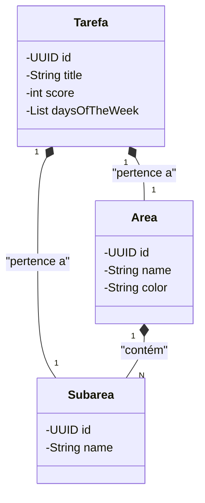

# RESTful API - Abito Arcano

Java RESTful API - To Do List

## Diagrama de Classes

```mermaid
classDiagram
class Tarefa {
    -UUID id
    -String title
    -int score
    -List<Integer> daysOfTheWeek
}

class Area {
    -UUID id
    -String name
    -String color
}

class Subarea {
    -UUID id
    -String name
}

Tarefa "1" *-- "1" Area : "pertence a"
Tarefa "1" *-- "1" Subarea : "pertence a"
Area "1" *-- "N" Subarea : "contém"
```
